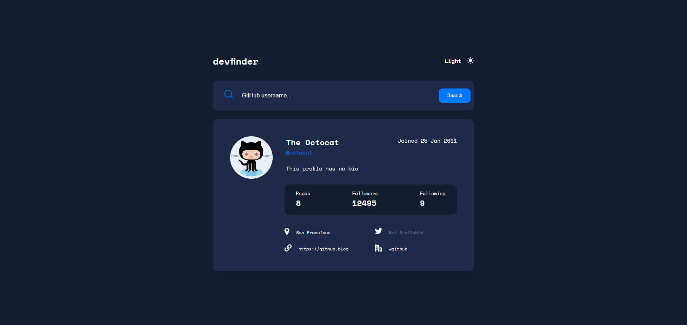
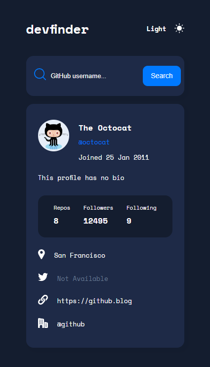

# Frontend Mentor - GitHub user search app solution

This is a solution to the [GitHub user search app challenge on Frontend Mentor](https://www.frontendmentor.io/challenges/github-user-search-app-Q09YOgaH6). Frontend Mentor challenges help you improve your coding skills by building realistic projects.

## Table of contents

- [Overview](#overview)
  - [The challenge](#the-challenge)
  - [Screenshot](#screenshot)
  - [Links](#links)
- [My process](#my-process)
  - [Built with](#built-with)
  - [What I learned](#what-i-learned)
  - [Continued development](#continued-development)
  - [Useful resources](#useful-resources)
- [Author](#author)
- [Acknowledgments](#acknowledgments)

**Note: Delete this note and update the table of contents based on what sections you keep.**

## Overview

### The challenge

Users should be able to:

- View the optimal layout for the app depending on their device's screen size
- See hover states for all interactive elements on the page
- Search for GitHub users by their username
- See relevant user information based on their search
- Switch between light and dark themes
- **Bonus**: Have the correct color scheme chosen for them based on their computer preferences. _Hint_: Research `prefers-color-scheme` in CSS.

### Screenshot

### Links

- Solution URL: [https://github.com/Darko96/github-user-search-app]
- Live Site URL: [https://github-user-search-app-v1.netlify.app/]

## My process

### Built with

- Semantic HTML5 markup
- CSS custom properties
- Flexbox
- CSS Grid
- Desktop-first workflow
- [React](https://reactjs.org/) - JS library

### What I learned

I learned how to make dark mode.

### Continued development

I'll keep making project so I can practice what I have learned so far, so I can make even bigger projects with React.

### Useful resources

- [A Complete Guide to Grid](https://css-tricks.com/snippets/css/complete-guide-grid/) - This helped me a lot ot understand CSS Grid.
- [A Complete Guide to Flexbox](https://css-tricks.com/snippets/css/a-guide-to-flexbox/) - This helped me a lot ot understand flex-box.
- [A Complete Guide to CSS Media Queries](https://css-tricks.com/a-complete-guide-to-css-media-queries/) - This helped me a lot to understand media queries.
- [React Documentation](https://react.dev/) - This helped me a lot to understand react.

## Author

- Portfolio [Darko Mijatovic](https://darko96.github.io/portfolio/)
- LinkedIn - [Darko Mijatovic](https://www.linkedin.com/in/darko-mijatovic-512384231/)
- Frontend Mentor - [@Darko96](https://www.frontendmentor.io/profile/Darko96)
- Instagram - [darkomiijatovic](https://www.instagram.com/darkomiijatovic/)

## Acknowledgments

I want to thank a lot to everyone in Frontend Mentor team. Because they made an awesome website where we can practice what we learn.

Thank you so much for checking my project and Any feedback is highly appreciated.
